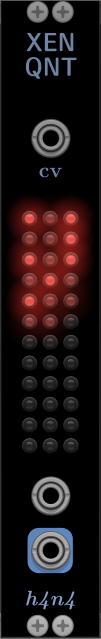

# VCV Modules
A module collection for the eurorack emulator [VCV Rack](https://www.vcvrack.com)

### Xen Quantizer

A polyphonic quantizer module that supports any tuning that can be specified in a [scala](https://huygens-fokker.org/scala/) file. Scala files are loaded via the context menu. Notes in the tuning can be turned on and off by clicking on the corresponding LED button. This can also be done by sending a polyphonic signal into the CV input.

## Building and installing from source
To build, make sure the environment variable RACK_DIR points to the VCV Rack 2.0 SDK directory. The SDK can be downloaded from the VCV Rack website. Then:

<pre>
git clone https://github.com/hannakoppelaar/vcv-modules.git
cd vcv-modules
make install
</pre>

This will build the plugins and copy them to your VCV plugins folder. The plugins should then be available when you (re-)start VCV Rack.

